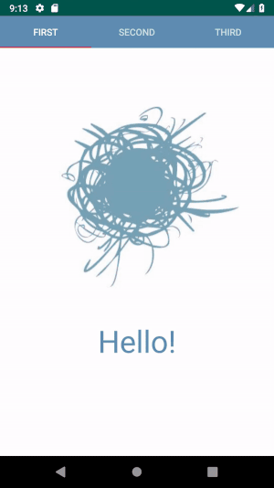

# Shared Element View Pager
This library allows you to perform Shared Element Transition **between** ViewPager pages.
It's an alpha version so feel free to create pull requests or modify it by your own.



## Contents
- **demo** - directory with demo android app that shows Shared Element Transition between ViewPager pages.

- **shared-element-view-pager** - the library itself

## Usage
### Adding library
1. Make sure you have jcenter() in you repositories
```        
allprojects {
    repositories {
        google()
        jcenter() //All android studio projects have this repo by default
    }
}
```
<br/>
<br/>


2. Add library to module dependencies
```   
dependencies {
    //...     
    implementation 'com.github.kirillgerasimov:shared-element-view-pager:0.0.1-alpha'
}
```
<br/>
<br/>
<br/>


### Creating shared element transitions

1. Add all fragments from your ViewPager to the List in the same order.
```
        ArrayList<Fragment> fragments = new ArrayList<>();
        fragments.add(hello_fragment);
        fragments.add(small_picture_fragment);
```
<br/>
<br/>


2. Create *SharedElementPageTransformer* presumably in *Activity.onCreate()*. <br/>
*this* refers to activity:
```
        SharedElementPageTransformer transformer =
                new SharedElementPageTransformer(this,  fragments);
```
<br/>
<br/>


3. Add shared transition by passing pairs of view ids, that need to be linked together 

```
        transformer.addSharedTransition(R.id.smallPic_image_cat, R.id.bigPic_image_cat);
        transformer.addSharedTransition(R.id.bigPic_image_cat, R.id.smallPic_image_cat);

        transformer.addSharedTransition(R.id.smallPic_text_label, R.id.bigPic_text_label);
        transformer.addSharedTransition(R.id.bigPic_text_label, R.id.smallPic_text_label);

        transformer.addSharedTransition(R.id.third_text, R.id.smallPic_text_label);
        transformer.addSharedTransition(R.id.smallPic_text_label, R.id.third_text);
```
<br/>
<br/>


4. Set our *transformer* to ViewPager's pageTransformer **AND** onPageChangeListener.
```
        viewPager.setPageTransformer(false, transformer);
        viewPager.addOnPageChangeListener(transformer);
```
<br/>
<br/>


Look at *ki.pagetransformer.sharedelement.demo.MainActivity* and compile the demo for more details.
<br/>
<br/>


### Restrictions
Note that  *SharedElementPageTransformer* requires page width to be equal to screen to work properly. 
